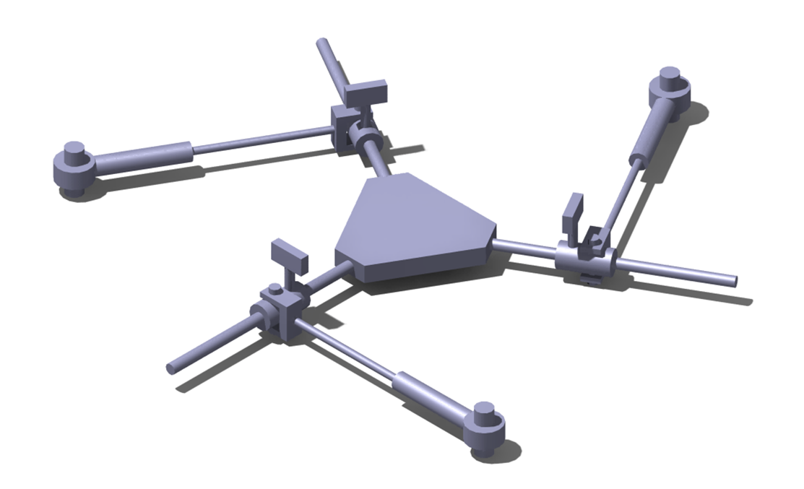
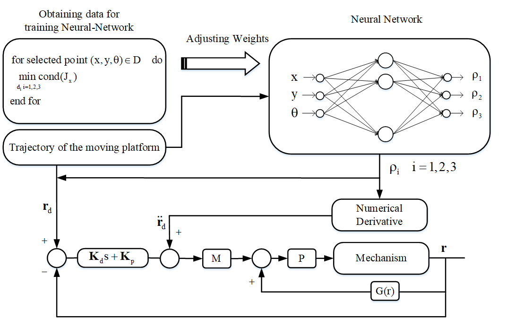

# Redundancy Resolution Using Neural-Network

Kinematic redundancy can be exploited to improve the performance of parallel mechanisms. Nevertheless, motion planning and control of kinematically redundant parallel mechanisms (KRPM) are challenging problems. In this research, a novel class of KRPMs with a reconfigurable platform is introduced. The dynamic equations of motion are derived. Then, a neural network approach is used for the motion planning of a manipulator in the new class. The multilayer perceptron-based neural network (MLP) is used for training data. The results show that the method can be implemented online for the control of the mechanism. Also, since the platform is reconfigurable, the introduced mechanisms can be used for grasping irregular objects. The motion of the mechanism is simulated for singularity avoidance and grasping.   

 
Fig. 1 Block diagram of the proposed control scheme

 
Fig. 2 CAD model of the 3-RPRP mechanism for the purpose of grasping

# More Information

For more application, please see the [publication](https://asmedigitalcollection.asme.org/mechanismsrobotics/article-abstract/15/2/021004/1141076/Modeling-and-Real-Time-Motion-Planning-of-a-Class).